# Autonomous Cleaning Robot (Computer Vision Module)

This project was part of a **college-funded seed grant** to design and prototype an **autonomous cleaning robot** from scratch.

The robot integrates:

* **SLAM & navigation** (developed by a teammate - [coverage planner repo](https://github.com/JatinPatil2003/CleaningRobot))
* **Computer vision & machine learning** (this repo - my contribution)

The **goal** was to enable the robot not only to move autonomously and map rooms efficiently, but also to:

* Dynamically **detect and avoid obstacles** (people, pets, furniture, objects)
* **Identify unclean environments** such as spills, dirty floors, and small garbage
* Guide the cleaning mechanism toward those detected regions

---

## ✅ Key Contributions

* Built a **custom dataset** in Roboflow tailored for cleaning robot needs.
* Performed a **comparative analysis** of six transfer learning algorithms.
* Trained & evaluated models across YOLO, EfficientDet, Faster R-CNN, SSD, DETR, and InceptionV3.
* Produced a **research paper (under review)** based on findings.
* Integrated vision module into the robot prototype with working demos.

---

## Dataset

Due to a lack of suitable open-source datasets, I built a **custom dataset in Roboflow**:
 [Cleaning Bot Dataset 2.0 on Roboflow](https://universe.roboflow.com/test-hmoom/cleaning_bot_dataset_2.0)

**Classes created:**

* `home_object`
* `waste`
* `spill`
* `person`
* `pet`

---

## 📒 Notebooks

* `cleaning_bot_YOLO.ipynb` – YOLOv8
* `cleaning_bot_EfficientDet.ipynb` – EfficientDet
* `cleaning_bot_FasterRCNN.ipynb` – Faster R-CNN
* `cleaning_bot_SingleShotDetector.ipynb` – SSD
* `cleaning_bot_DEtectionTRansformer.ipynb` – DETR
* `cleaning_bot_InceptionV3.ipynb` – InceptionV3 baseline
* `model_test.ipynb` – Testing trained models

---

## 📊 Training Results

| Model       | Graph                                                     |
|-------------| --------------------------------------------------------- |
| YOLOv8      | 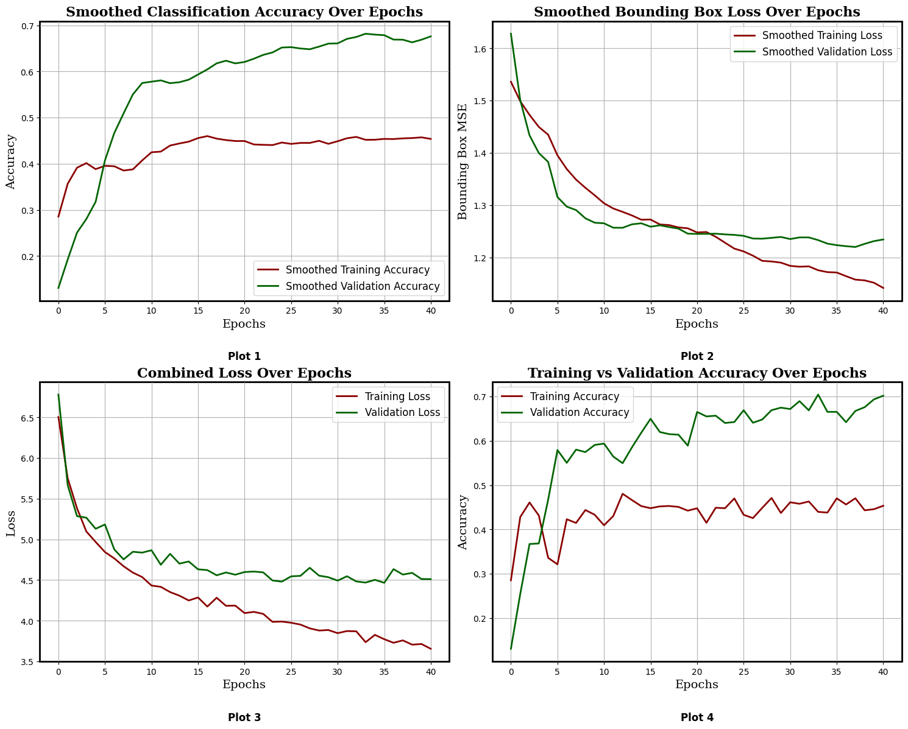                 |
| EfficientDet | 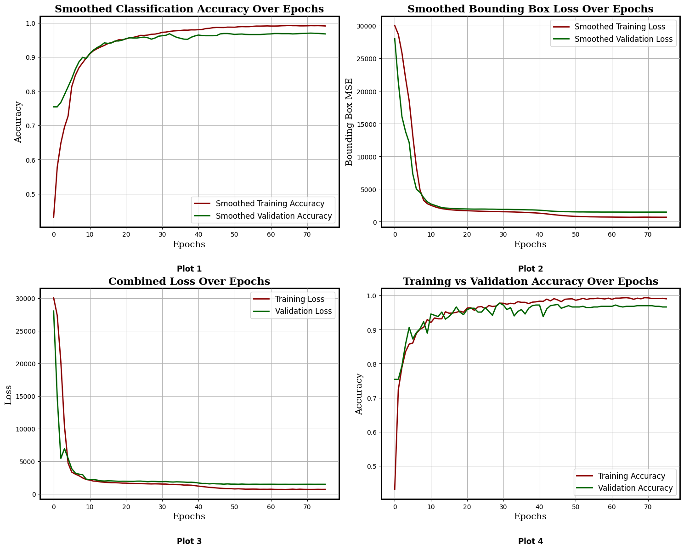         |
| FasterRCNN  | 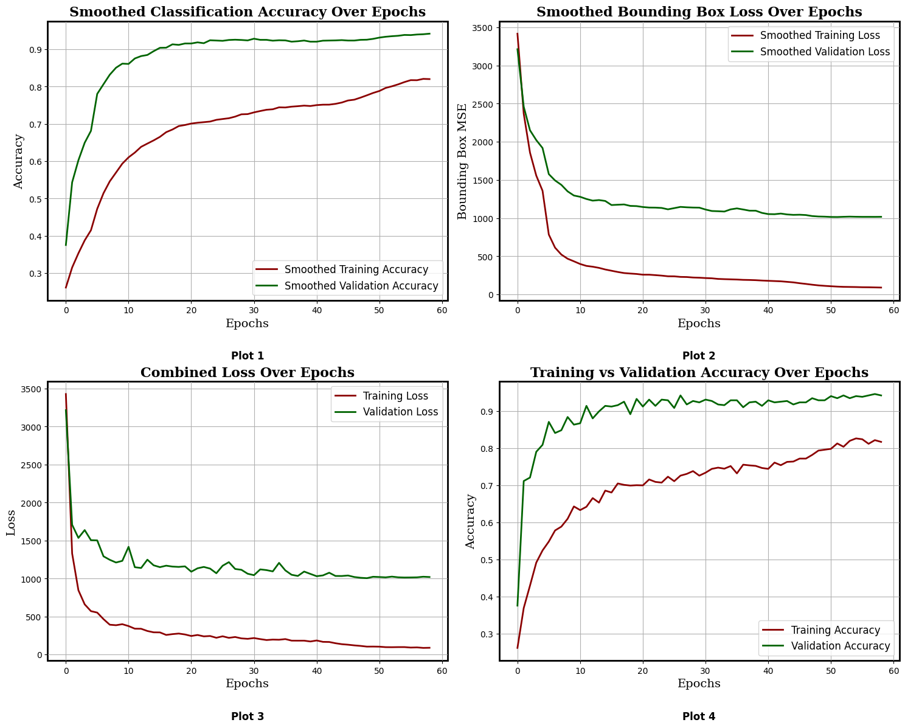           |
| SSD         | 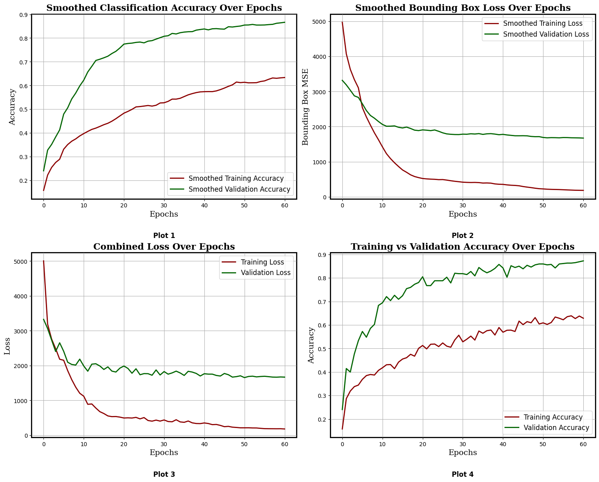   |
| DETR        | 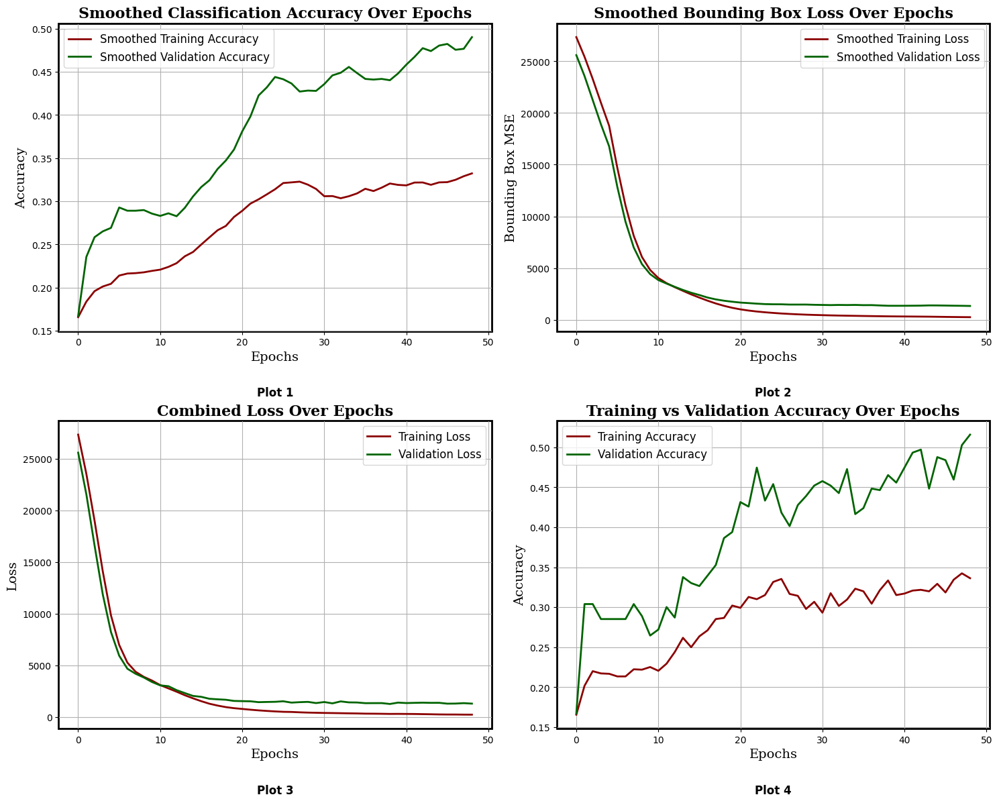 |
| InceptionV3 | 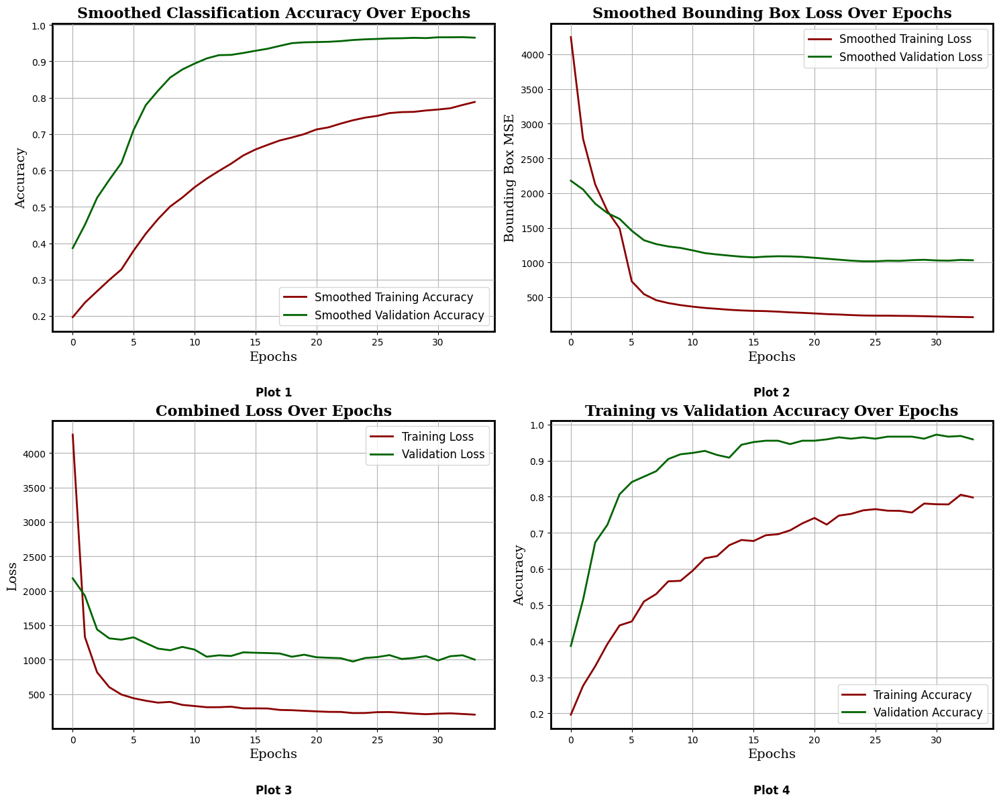          |

---

## 🖼️ Detection Outputs

| Model        | Example Output                                            |
|--------------| --------------------------------------------------------- |
| YOLOv8       | 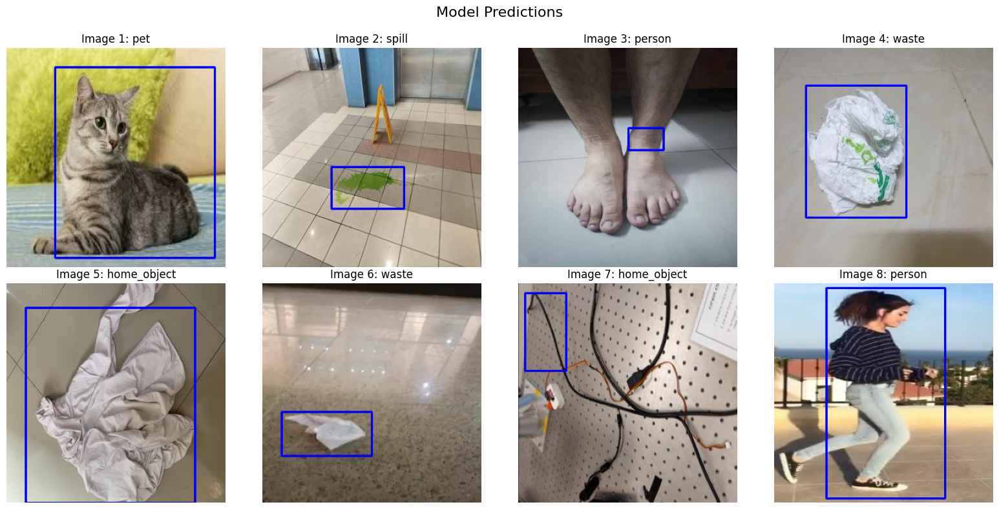                 |
| EfficientDet | 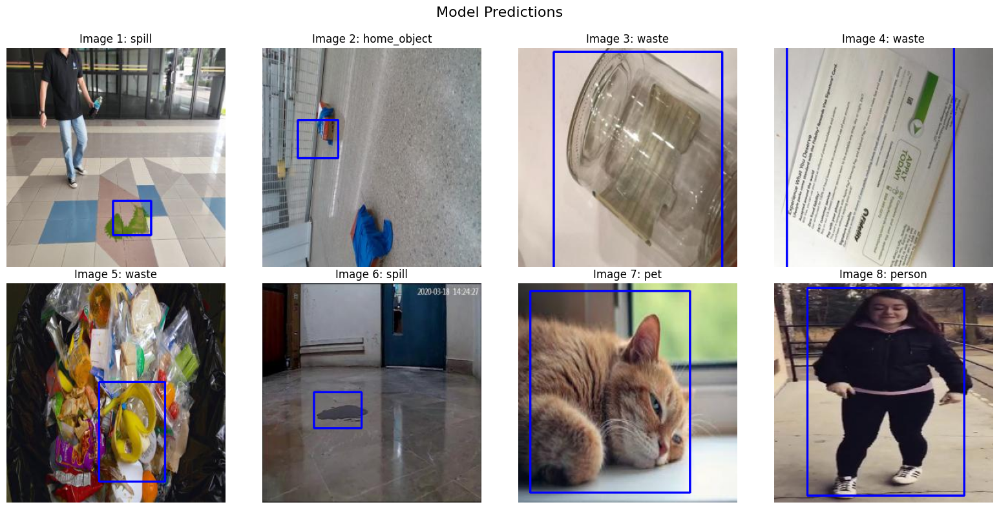         |
| FasterRCNN   | 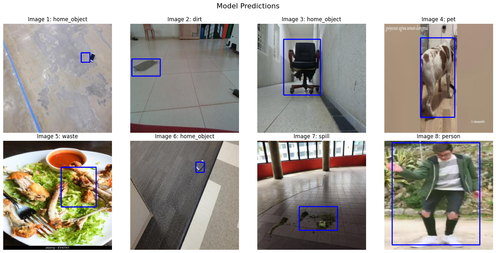           |
| SSD          | 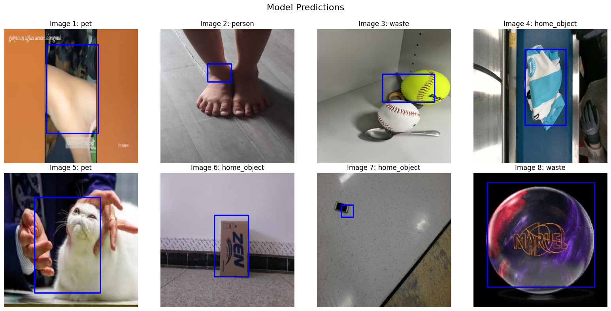   |
| DETR         | 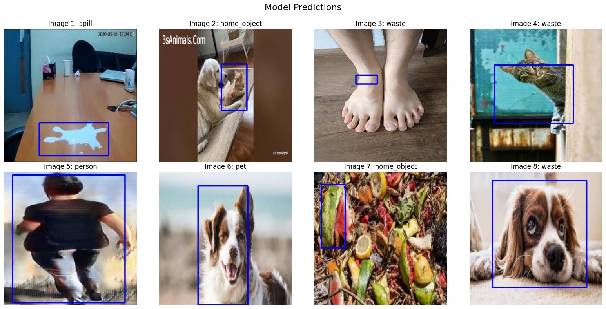 |
| InceptionV3  | 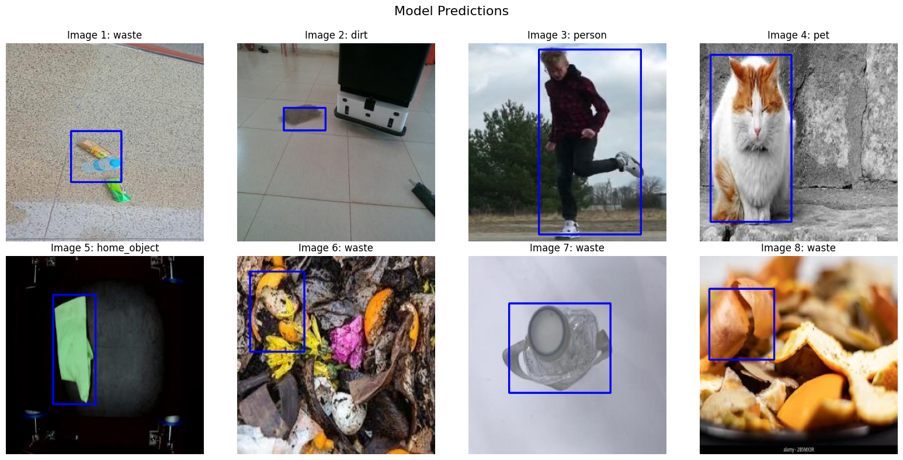          |

---

## 🎥 Prototype Demo Videos

* [botTest1.mp4](videos/botTest1.mp4)
* [botTest2.mp4](videos/botTest2.mp4)
* [botTest3.mp4](videos/botTest3.mp4)
* [botTest4.mp4](videos/botTest4.mp4)

---

## 🔮 Future Work (by next team)

The project was handed off for continued development, with goals including:

* 🔋 **Auto-docking** to charging stations
* 🎤 **Voice/audio command control**
* 🤖 **Manipulator arm** for picking up objects
* 🧭 **Improved traversal** efficiency and obstacle handling
* 🧹 **Enhanced cleaning mechanism**

---

## Acknowledgments

This project was supported through a **college-funded seed grant** and completed as part of our capstone work.
